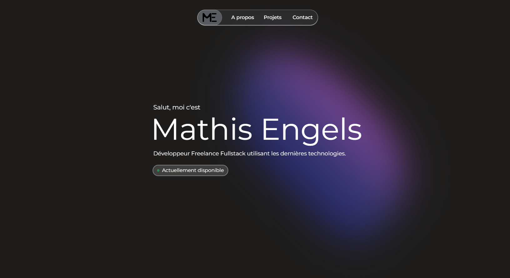

<h1 align="center">
    Mathis Engels Portfolio</br>
    <a href="https://mathisengels.fr">mathisengels.fr</a>
</h1>

<div align="center">
    
</div>


Welcome to my portfolio, built with [Astro](https://astro.build/).

It showcase my skills, projects and how to contact me.

## Local setup
If, for some reason, you want to build this locally, here's the steps:
1. Clone the repository:
    ```sh
    git clone https://github.com/mathisengels/mathisengels.fr
    ```

2. Navigate to the project directory:
    ```sh
    cd mathisengels.fr
    ```

3. Install dependencies:
    ```sh
    npm install
    ```

4. Start the development server:
    ```sh
    npm run dev
    ```

5. Enjoy 🚀

## Contact

If you have any questions or just want to connect, feel free to reach me at [contact@mathisengels.fr](mailto:contact@mathisengels.fr) or on [Linkedin](https://www.linkedin.com/in/mathisengels/).